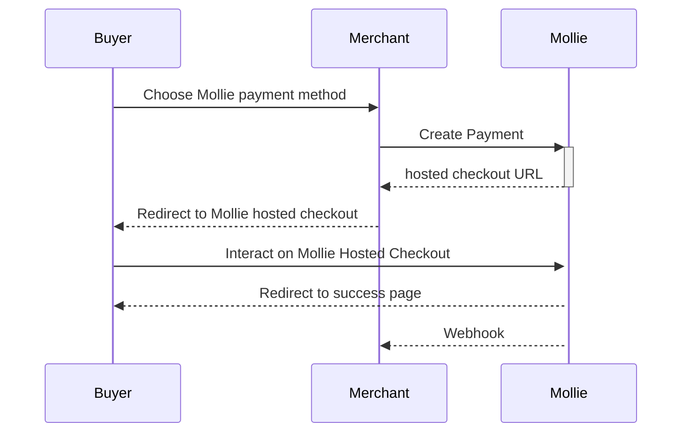
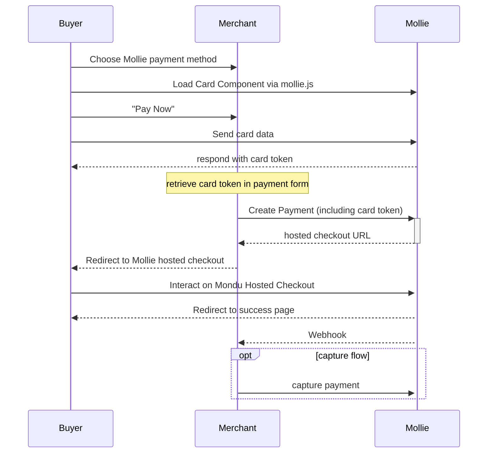
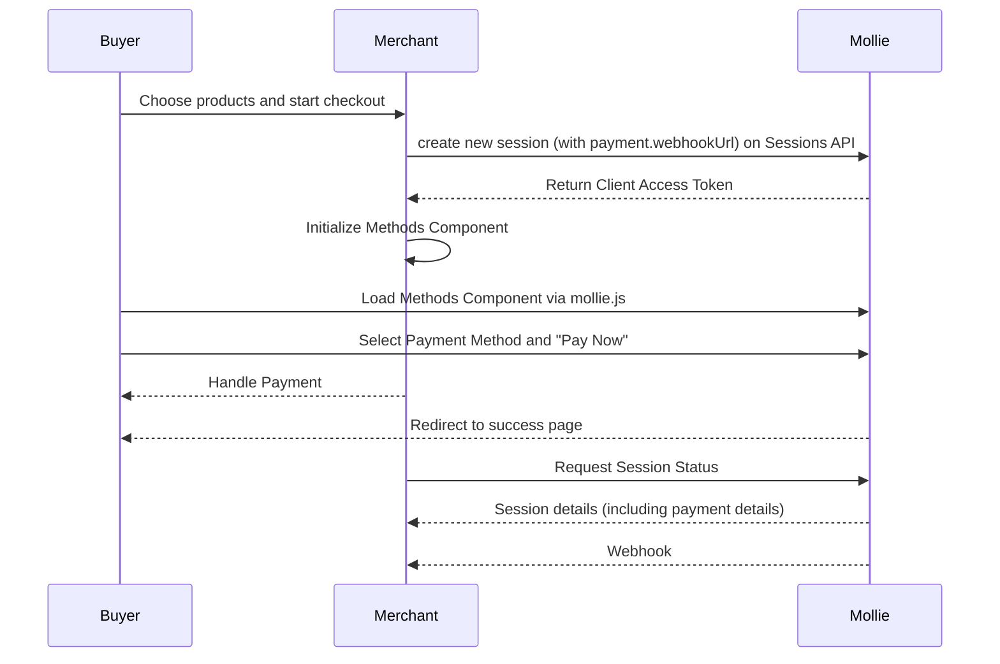
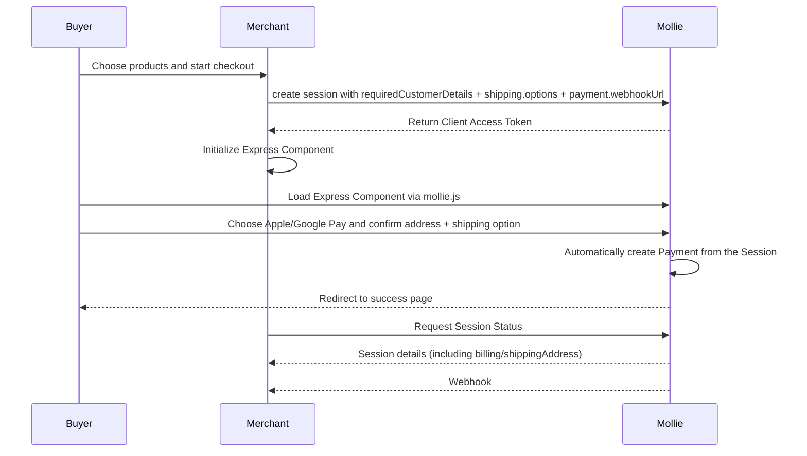

This is a [Next.js](https://nextjs.org/) project that utilizes Mollie's node JS library.


## Payment Flows

### Hosted Checkout



### Components v1 (+auth/capture)



### Components v2

Components v2 utilizies Mollie's Sessions API and a new version of our mollie.js. This means the core concept shifts from creating a payment with a server-side request to setting up a session, displaying components for the buyer, who will then trigger the payment generation from the frontend.

After the successUrl was called, details for the payment are available from the session or through a webhook --> GET payment call.

Express Components for Apple/Google Pay and PayPal Express can request address details from the buyer and hand over possible shipping options, too.

#### Methods Component



#### Express Components with Address Collection

Express Components (Apple Pay, Google Pay) can collect the buyer's email and billing/shipping address for you, instead of your own checkout form. To turn this on, request it on session creation with `requiredCustomerDetails`, and optionally attach `shipping.options` so the buyer can pick a delivery method.

`@mollie.com` users see an "address source" toggle in this demo: switching it to "session" recreates the Mollie Session with `requiredCustomerDetails: ['email', 'billing-address', 'shipping-address']` and hides our own address form, since Mollie now owns that data.

Once the buyer confirms their payment method, the Session creates the Payment automatically — there is no merchant API call to make at that point. The buyer is then redirected to the session's `redirectUrl`.



Fulfilment should be triggered from the Payment's webhook, not the Session status — the Session status is for informing the buyer, not for driving order processing.

## Getting Started

After cloning the project, create your own copy of the environment file:

```bash
cp .env.example .env.local
nano .env.local
```

### Environment Variables Explained

- `MOLLIE_API_KEY` is your test API key (starts with `test_`)
- `NEXT_PUBLIC_MOLLIE_PROFILE` is your profile ID. This is propagated to the client and is needed for Mollie's components to work
- `DOMAIN` is the domain the app is running on, including protocol (`https://` or `http://`)
- `WEBHOOK_URL` is a URL where Mollie will send webhooks. Can be different. Recommendation for local development: https://webhook.site

You'll need your own Mollie API key from Mollie's merchant dashboard.

If no domain is set, we will simply use localhost for redirects. If no webhook URL is set, webhooks will fail.

Then, run the development server:

```bash
npm run dev
```

Open [http://localhost:3000](http://localhost:3000) with your browser and start testing payments.

## Todo

✅ make payments work

✅ log webhooks

✅ Card Components

✅ Auth/Capture

✅ Get payment methods from methods API

✅ list recent payments

✅ Use Mollie Components where it makes sense

✅ (Multi)partial captures

✅ Make Payments Table show more detail based on screen size (Card view on mobile, expanding table on desktop)

[ ] Show Error Messages on Frontend (where it makes sense)

✅ Auto-Authorize Card and Klarna Payments (and only Cards and Klarna)

[ ] Bring your own Mollie Account by registering as an OAuth App and using Mollie Connect (this is a huge one)
